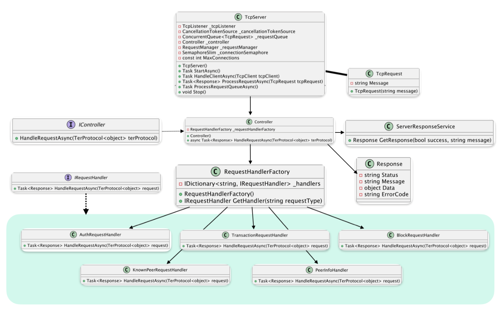

## 3 Project Description

### 3.1 TCP Server Architecture

#### General Description

This module implements a TCP server for processing requests in a distributed network. It accepts connections, processes incoming requests, and forwards them to the appropriate service units. The service units route the requests to the relevant services and return responses to the clients.

Figure 3: UML diagram of the server

The **diagram (Figure 3)** illustrates the operation of the **TCP server**, which processes incoming requests using **controllers** and **handler classes**.

The main class, **`TcpServer`** (shown in Figure 3),:
- listens for incoming connections using **`TcpListener`**
- adds requests to the **`_requestQueue`**
- processes them using the **`Controller`**
- limits the number of connections using **`MaxConnections`**

The server is started with the **`StartAsync()`** method, while **`HandleClientAsync()`** is responsible for handling client communication.

Requests are represented by the **`TcpRequest`** class (Figure 3), which contains a text message. Responses are represented by the **`Response`** structure, which includes:
- status
- message
- data
- error code

---

The **`Controller`** (shown in Figure 3) manages request processing using **`RequestHandlerFactory`**, which selects the appropriate handler and returns a **`Response`**.

The **`RequestHandlerFactory`**:
- stores handler classes (**`IRequestHandler`**) in **`_handlers`**
- provides the appropriate handler based on the request type

Implementations of **`IRequestHandler`** include:
- **`AuthRequestHandler`** — authentication
- **`KnownPeerRequestHandler`** — peer information processing
- **`TransactionRequestHandler`** — transaction processing
- **`BlockRequestHandler`** — block processing
- **`PeerInfoHandler`** — peer-related data handling

The **`ServerResponseService`** (shown in Figure 3) is responsible for creating **`Response`** objects.

---

### Workflow (Figure 3)

1. **`TcpServer`** accepts a connection
2. Creates a **`TcpRequest`**
3. Passes it to the **`Controller`**
4. **`RequestHandlerFactory`** selects the appropriate handler
5. The selected **`IRequestHandler`** processes the request
6. A **`Response`** is created
7. The response is returned through the **`Controller`** back to the server
8. The server sends the response to the client

---

This approach ensures **flexibility** and **scalability** of the server.
