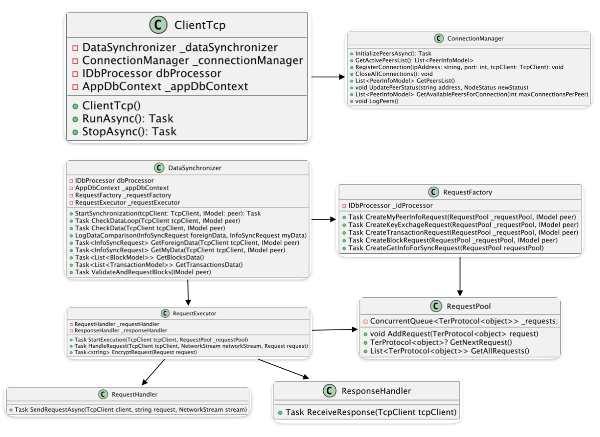
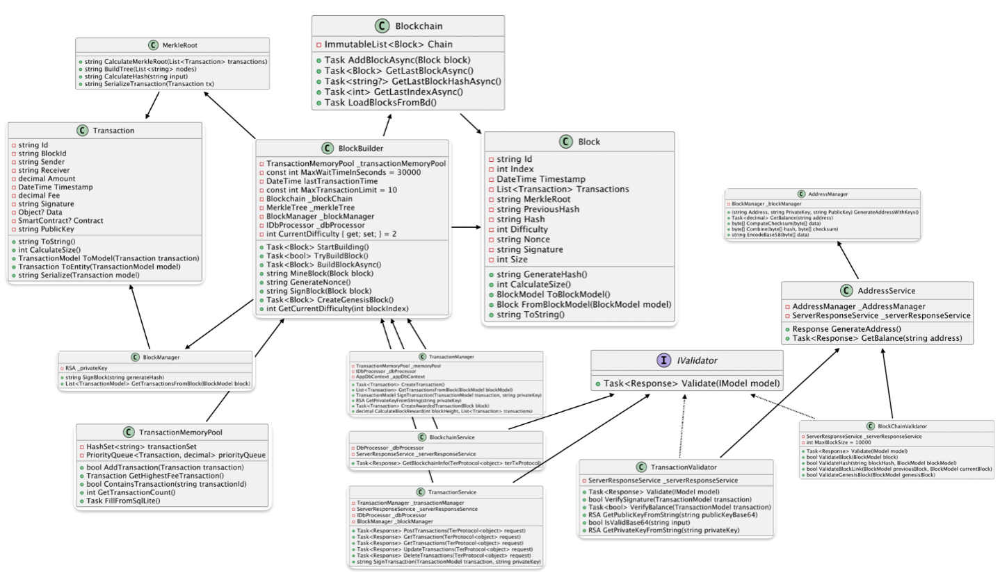
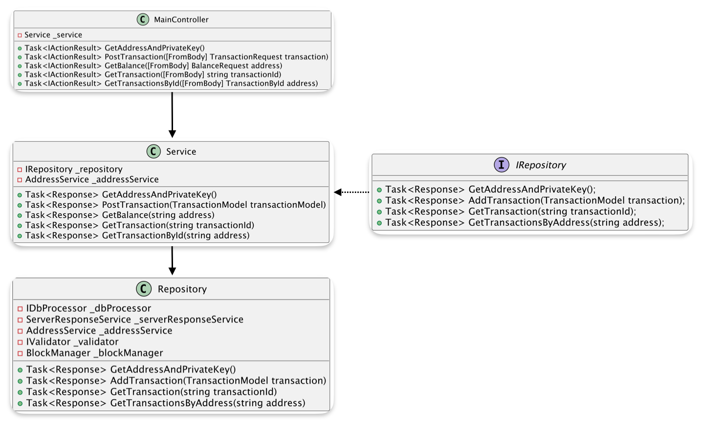
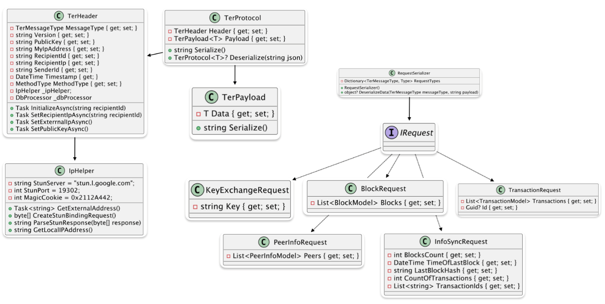
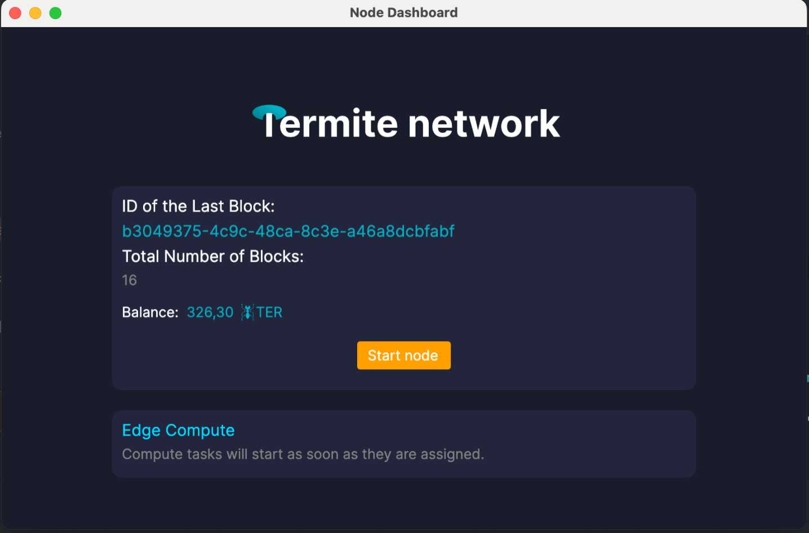

## 3 Project Description

### 3.1 TCP Server Architecture

#### General Description

This module implements a TCP server for processing requests in a distributed network. It accepts connections, processes incoming requests, and forwards them to the appropriate service units. The service units route the requests to the relevant services and return responses to the clients.

Figure 3: UML diagram of the server

The **diagram (Figure 3)** illustrates the operation of the **TCP server**, which processes incoming requests using **controllers** and **handler classes**.

The main class, **`TcpServer`** (shown in Figure 3),:
- listens for incoming connections using **`TcpListener`**
- adds requests to the **`_requestQueue`**
- processes them using the **`Controller`**
- limits the number of connections using **`MaxConnections`**

The server is started with the **`StartAsync()`** method, while **`HandleClientAsync()`** is responsible for handling client communication.

Requests are represented by the **`TcpRequest`** class (Figure 3), which contains a text message. Responses are represented by the **`Response`** structure, which includes:
- status
- message
- data
- error code

---

The **`Controller`** (shown in Figure 3) manages request processing using **`RequestHandlerFactory`**, which selects the appropriate handler and returns a **`Response`**.

The **`RequestHandlerFactory`**:
- stores handler classes (**`IRequestHandler`**) in **`_handlers`**
- provides the appropriate handler based on the request type

Implementations of **`IRequestHandler`** include:
- **`AuthRequestHandler`** — authentication
- **`KnownPeerRequestHandler`** — peer information processing
- **`TransactionRequestHandler`** — transaction processing
- **`BlockRequestHandler`** — block processing
- **`PeerInfoHandler`** — peer-related data handling

The **`ServerResponseService`** (shown in Figure 3) is responsible for creating **`Response`** objects.

---

### Workflow (Figure 3)

1. **`TcpServer`** accepts a connection
2. Creates a **`TcpRequest`**
3. Passes it to the **`Controller`**
4. **`RequestHandlerFactory`** selects the appropriate handler
5. The selected **`IRequestHandler`** processes the request
6. A **`Response`** is created
7. The response is returned through the **`Controller`** back to the server
8. The server sends the response to the client

---

This approach ensures **flexibility** and **scalability** of the server.

### 3.1.1 Main Classes and Their Interactions

#### 3.1.1.1 TcpServer (Main Server)

**TcpServer** manages network connections and processes incoming TCP requests.

**Main components:**
- **`_tcpListener`** – listens for incoming connections
- **`_cancellationTokenSource`** – manages server shutdown
- **`_requestQueue`** – queue of incoming TCP requests
- **`_controller`** – main request processor
- **`_requestManager`** – handles request decryption and message processing
- **`_connectionSemaphore`** – limits the number of active connections
- **`MaxConnections`** – maximum number of simultaneous connections

**Main methods:**
- **`StartAsync()`** – starts the server and begins listening for connections
- **`HandleClientAsync(TcpClient tcpClient)`** – handles client connections
- **`ProcessRequestAsync(TcpRequest tcpRequest)`** – sends a request for processing
- **`ProcessRequestQueueAsync()`** – processes the request queue
- **`Stop()`** – stops the server

---

#### 3.1.1.2 TcpRequest (TCP Request)

Represents a request received from a client.

- **`Message`** – string containing request data

---

#### 3.1.1.3 Response

Used to return the result of request processing.

- **`Status`** – response status
- **`Message`** – textual description of the result
- **`Data`** – additional data
- **`ErrorCode`** – error code (if applicable)

---

#### 3.1.1.4 Controller (Request Controller)

Responsible for routing and processing requests.

**Main components:**
- **`_requestHandlerFactory`** – provides request handlers

**Main method:**
- **`HandleRequestAsync(TerProtocol<object>)`** – forwards the request to the appropriate handler

---

#### 3.1.1.5 RequestHandlerFactory

Selects the appropriate handler for each request type.

**Main method:**
- **`GetHandler(string requestType)`** – returns a handler based on request type

---

#### 3.1.1.6 ServerResponseService

Responsible for creating responses.

- **`GetResponse(bool success, string message, object data)`** – creates a response object

---

#### 3.1.1.7 IController (Controller Interface)

Defines the method for handling requests:

- **`HandleRequestAsync(TerProtocol<object> terProtocol)`**

---

#### 3.1.1.8 IRequestHandler (Request Handler Interface)

Defines the method for handling requests:

- **`HandleRequestAsync(TerProtocol<object> terProtocol)`**

---

#### 3.1.1.9 Request Handlers

Each handler implements **`IRequestHandler`** and is responsible for a specific type of request:

- **`AuthRequestHandler`** – authentication requests
- **`KnownPeerRequestHandler`** – known peers processing
- **`TransactionRequestHandler`** – transaction processing
- **`BlockRequestHandler`** – block-related requests
- **`PeerInfoHandler`** – peer information handling
- **`BlockchainHandler`** – blockchain state requests

---

#### 3.1.1.10 Relationships Between Classes

- **`TcpServer`** uses **`Controller`** to route requests
- **`Controller`** calls **`RequestHandlerFactory`** to get the appropriate handler
- **`RequestHandlerFactory`** returns an **`IRequestHandler`** based on request type
- **`ServerResponseService`** creates the response sent to the client

---

### 3.1.2 Conclusion

This server implements TCP request processing, routing, and delegation to appropriate handlers. The system supports modularity, allowing easy addition of new request types and handlers.

---

## 3.2 TCP Client Architecture

### General Description

The client of a decentralized network node is responsible for establishing connections to known nodes, managing connections, and synchronizing data. It uses **`ConnectionManager`** for initializing and registering connections and **`DataSynchronizer`** for data transfer and updates.

The client automatically connects to active nodes and handles network errors.

Figure 4: UML diagram of the client

### 3.2.1 Main Classes and Their Interactions

#### 3.2.1.1 ClientTcp

**Attributes:**
- **`_dataSynchronizer`** — data synchronization object
- **`_connectionManager`** — connection management object
- **`_dbProcessor`** — database processing object
- **`_appDbContext`** — database context object

**Methods:**
- **`RunAsync()`** — starts the client and establishes connections to other nodes
- **`StopAsync()`** — terminates all node connections

---

#### 3.2.1.2 IDbProcessor (Interface)

**Description:** Interface for implementing database data processing.

**Methods:**
- **`ProcessService<T>`** — processes database queries

---

#### 3.2.1.3 DataSynchronizer

**Description:** Manages data synchronization between the client and the server. Interacts with the database and performs synchronization queries.

**Attributes:**
- **`_dbProcessor`** — data processing object
- **`_appDbContext`** — database context
- **`_requestFactory`** — request creation factory
- **`_requestExecutor`** — request execution handler

**Methods:**
- **`StartSynchronization()`** — starts the data synchronization process
- **`CheckDataLoop()`** — performs cyclic data checks
- **`CheckData()`** — checks data for synchronization
- **`LogDataComparison()`** — logs data comparison results
- **`GetForeignData()`** — retrieves data from another node
- **`GetMyData()`** — retrieves local node data
- **`GetBlocksData()`** — retrieves block data
- **`GetTransactionsData()`** — retrieves transaction data
- **`ValidateAndRequestBlocks()`** — validates and requests block data

---

#### 3.2.1.4 RequestExecutor

**Description:** Handles request execution and response processing.

**Attributes:**
- **`_requestHandler`** — request handler
- **`_responseHandler`** — response handler

**Methods:**
- **`StartExecution()`** — starts request execution
- **`HandleRequest()`** — processes a request
- **`EncryptRequest()`** — encrypts the request

---

#### 3.2.1.5 RequestHandler

**Description:** Handles sending requests.

**Methods:**
- **`SendRequestAsync()`** — sends a request asynchronously

---

#### 3.2.1.6 ResponseHandler

**Description:** Handles receiving responses.

**Methods:**
- **`ReceiveResponse()`** — receives a response from the server

---

#### 3.2.1.7 ConnectionManager

**Description:** Manages connections to other nodes.

**Methods:**
- **`InitializePeersAsync()`** — initializes available nodes
- **`GetActivePeersList()`** — retrieves active nodes
- **`RegisterConnection()`** — registers a node connection
- **`CloseAllConnections()`** — closes all connections
- **`GetPeersList()`** — retrieves all nodes
- **`UpdatePeerStatus()`** — updates node status
- **`GetAvailablePeersForConnection()`** — retrieves nodes available for connection considering limits
- **`LogPeers()`** — logs node states

---

#### 3.2.1.8 Request

**Description:** Represents a request.

**Attributes:**
- **`Message`** — string containing the request message

---

#### 3.2.1.9 RequestFactory

**Description:** Service for creating different types of requests.

**Methods:**
- **`CreateMyPeerInfoRequest()`** — creates a request for peer info
- **`CreateKeyExchageRequest()`** — creates a key exchange request
- **`CreateTransactionRequest()`** — creates a transaction request
- **`CreateBlockRequest()`** — creates a block data request
- **`CreateGetInfoForSyncRequest()`** — creates a synchronization request

---

#### 3.2.1.10 RequestPool

**Description:** Manages request queue and execution order.

**Attributes:**
- **`_requests`** — request queue

**Methods:**
- **`AddRequest()`** — adds a request to the queue
- **`GetNextRequest()`** — retrieves the next request
- **`GetAllRequests()`** — retrieves all requests

---

#### 3.2.1.11 DbProcessor

**Description:** Implementation of database query processing.

**Methods:**
- **`Process()`** — processes database queries

---

#### 3.2.1.12 AppDbContext

**Description:** Database context.

**Methods:**
- **`SaveChanges()`** — saves changes to the database

---

#### 3.2.1.13 Relationships Between Classes

- **`ClientTcp`** uses **`DataSynchronizer`**, **`ConnectionManager`**, **`DbProcessor`**, and **`AppDbContext`**
- **`DataSynchronizer`** uses **`RequestFactory`** and **`RequestExecutor`**
- **`RequestExecutor`** uses **`RequestHandler`** and **`ResponseHandler`**

---

### 3.2.2 Conclusion

This process ensures efficient data synchronization between nodes in a decentralized network. By comparing local storage data with data from remote nodes, it is possible to identify missing or invalid data and automatically update it.

Using **`RequestFactory`** to create requests and **`RequestExecutor`** to send them guarantees that each node always has up-to-date and consistent information. This mechanism contributes to the **security**, **reliability**, and **stability** of the entire network.

---

## 3.3 Blockchain Architecture

### General Description

In this project, the blockchain is used for immutable data storage. Each block contains valid user transactions and ensures their integrity using cryptographic functions.

The **Proof of Work (PoW)** consensus algorithm is used to validate blocks. It is implemented by searching for the correct **nonce**, which requires computational power. The node that solves the problem first is rewarded with network tokens. This incentivizes nodes to participate in maintaining the network and ensures its security.

---

### Consensus Algorithms

Various consensus algorithms are used in blockchain systems to validate transactions and protect the network from attacks:

- **Proof of Work (PoW)** — requires solving complex mathematical problems (nonce search), demanding high computational power
- **Proof of Stake (PoS)** — nodes with the largest coin holdings have priority in creating new blocks
- **Delegated Proof of Stake (DPoS)** — validators are selected by users, and blocks are created by a limited number of nodes
- **Proof of Authority (PoA)** — only approved nodes validate transactions, increasing speed but reducing decentralization
- **Proof of Burn (PoB)** — nodes burn coins to gain the right to validate transactions
- **Proof of Elapsed Time (PoET)** — uses random waiting time to determine which node creates the next block

---

### Justification for Choosing Proof of Work

The **Proof of Work** algorithm was chosen because it ensures a high level of **security** and **decentralization**. The requirement to solve complex computational problems makes attacks on the network extremely costly.

**Main advantages of PoW:**
- **Reliability** — requires significant computational resources, making block forgery nearly impossible
- **Decentralization** — accessible to any node without requiring large coin holdings
- **Immutability** — high computational complexity prevents altering transaction history

Despite its high energy consumption, **Proof of Work** remains one of the most proven and secure consensus algorithms, ensuring network protection and fair reward distribution among participants.

Figure 5: UML diagram of a blockchain

### 3.3.1 Main Classes and Their Interactions

#### 3.3.1.1 Blockchain

**Description:**  
The main class representing the blockchain. It manages the chain of blocks and provides methods for adding blocks and retrieving information about the latest block.

**Attributes:**
- **`Chain (ImmutableList<Block>)`** — list of blocks in the blockchain

**Methods:**
- **`AddBlockAsync(Block block)`** — adds a new block to the blockchain
- **`GetLastBlockAsync()`** — retrieves the last block
- **`GetLastBlockHashAsync()`** — retrieves the hash of the last block
- **`GetLastIndexAsync()`** — retrieves the index of the last block
- **`LoadBlocksFromBd()`** — loads blocks from the database

---

#### 3.3.1.2 Block

**Description:**  
Represents a single block in the blockchain.

**Attributes:**
- **`Id (string)`** — unique block identifier
- **`Index (int)`** — block index in the chain
- **`Timestamp (DateTime)`** — block timestamp
- **`Transactions (List<Transaction>)`** — list of transactions
- **`MerkleRoot (string)`** — Merkle root
- **`PreviousHash (string)`** — previous block hash
- **`Hash (string)`** — current block hash
- **`Difficulty (int)`** — mining difficulty
- **`Nonce (string)`** — nonce value
- **`Signature (string)`** — block signature
- **`Size (int)`** — block size in bytes

**Methods:**
- **`GenerateHash()`** — generates block hash
- **`CalculateSize()`** — calculates block size
- **`ToBlockModel()`** — converts block to data model
- **`FromBlockModel(BlockModel model)`** — creates block from model
- **`ToString()`** — returns string representation

---

#### 3.3.1.3 BlockBuilder

**Description:**  
Handles block creation, including genesis block generation and mining.

**Attributes:**
- **`_transactionMemoryPool`** — transaction memory pool
- **`_blockChain`** — blockchain instance
- **`_merkleTree`** — Merkle tree
- **`_blockManager`** — block manager
- **`_dbProcessor`** — database processor
- **`CurrentDifficulty (int)`** — current mining difficulty

**Methods:**
- **`StartBuilding()`** — starts block creation
- **`TryBuildBlock()`** — attempts to build a block
- **`BuildBlockAsync()`** — builds a block asynchronously
- **`MineBlock(Block block)`** — mines a block
- **`GenerateNonce()`** — generates nonce
- **`SignBlock(Block block)`** — signs a block
- **`CreateGenesisBlock()`** — creates genesis block
- **`GetCurrentDifficulty(int blockIndex)`** — returns difficulty

---

#### 3.3.1.4 BlockManager

**Description:**  
Manages block signatures.

**Attributes:**
- **`_privateKey (RSA)`** — private key for signing

**Methods:**
- **`SignBlock(string generateHash)`** — signs block hash
- **`GetTransactionsFromBlock(BlockModel block)`** — extracts transactions

---

#### 3.3.1.5 Transaction

**Description:**  
Represents a blockchain transaction.

**Attributes:**
- **`Id (string)`** — transaction ID
- **`BlockId (string)`** — associated block ID
- **`Sender (string)`** — sender
- **`Receiver (string)`** — receiver
- **`Amount (decimal)`** — transaction amount
- **`Timestamp (DateTime)`** — timestamp
- **`Fee (decimal)`** — transaction fee
- **`Signature (string)`** — transaction signature
- **`Data (object?)`** — additional data
- **`Contract (SmartContract?)`** — smart contract
- **`PublicKey (string)`** — sender’s public key

**Methods:**
- **`ToString()`** — string representation
- **`CalculateSize()`** — calculates size
- **`ToModel()`** — converts to model
- **`ToEntity()`** — converts back to entity
- **`Serialize()`** — serializes transaction

---

#### 3.3.1.6 MerkleRoot

**Description:**  
Handles Merkle tree operations and root calculation.

**Methods:**
- **`CalculateMerkleRoot(List<Transaction>)`** — calculates Merkle root
- **`BuildTree(List<string>)`** — builds tree
- **`CalculateHash(string input)`** — calculates hash
- **`SerializeTransaction(Transaction tx)`** — serializes transaction

---

#### 3.3.1.7 TransactionMemoryPool

**Description:**  
Manages transactions before they are added to a block.

**Attributes:**
- **`transactionSet (HashSet<string>)`** — transaction IDs
- **`priorityQueue (PriorityQueue<Transaction, decimal>)`** — priority queue

**Methods:**
- **`AddTransaction()`** — adds transaction
- **`GetHighestFeeTransaction()`** — returns highest fee transaction
- **`ContainsTransaction()`** — checks existence
- **`GetTransactionCount()`** — count of transactions
- **`FillFromSqlLite()`** — loads from database

---

#### 3.3.1.8 BlockchainService

**Description:**  
Provides blockchain-related operations.

**Attributes:**
- **`_dbProcessor`** — database processor
- **`_serverResponseService`** — response service

**Methods:**
- **`GetBlockchainInfo()`** — retrieves blockchain info

---

#### 3.3.1.9 TransactionService

**Description:**  
Handles transaction operations.

**Attributes:**
- **`_transactionManager`** — transaction manager
- **`_serverResponseService`** — response service
- **`_dbProcessor`** — database processor
- **`_blockManager`** — block manager

**Methods:**
- **`PostTransactions()`** — sends transactions
- **`GetTransaction()`** — retrieves transaction
- **`GetTransactions()`** — retrieves transactions
- **`UpdateTransactions()`** — updates transactions
- **`DeleteTransactions()`** — deletes transactions
- **`SignTransaction()`** — signs transaction

---

#### 3.3.1.10 TransactionManager

**Description:**  
Manages creation and processing of transactions.

**Attributes:**
- **`_memoryPool`** — transaction pool
- **`_dbProcessor`** — database processor
- **`_appDbContext`** — database context

**Methods:**
- **`CreateTransaction()`** — creates transaction
- **`GetTransactionsFromBlock()`** — retrieves transactions from block
- **`SignTransaction()`** — signs transaction
- **`GetPrivateKeyFromString()`** — extracts private key
- **`CreateAwardedTransaction()`** — creates reward transaction
- **`CalculateBlockReward()`** — calculates block reward

---

### 3.3.2 Conclusion

The creation and management of a blockchain is a complex process involving multiple interacting classes. Core classes such as **`Blockchain`**, **`Block`**, **`Transaction`**, **`TransactionManager`**, and **`BlockManager`** work together to ensure **integrity**, **security**, and **efficiency**.

- **`Blockchain`** manages block storage
- **`Block`** defines structure and cryptographic properties
- **`Transaction`** and related services manage transaction flow
- **`BlockBuilder`** and **`BlockManager`** handle mining and validation
- **Merkle trees** ensure efficient validation
- Services provide communication and database interaction

The system is highly **modular**, enabling easy extension and scalability. This architecture forms a solid foundation for building reliable and scalable blockchain applications.

Future improvements may include:
- smart contract support
- enhanced scalability mechanisms

---

## 3.4 API Architecture

### General Description

The node API is designed to interact with the blockchain node and enable integration with external applications, such as mobile wallet apps.

The system provides endpoints for:
- generating addresses and private keys
- performing transactions
- checking balances
- retrieving transaction data  

Figure 6: UML API Diagram

### 3.4.1 Main Classes and Their Interactions

#### 3.4.1.1 Service

**Description:**  
The **`Service`** class is responsible for providing higher-level business logic related to addresses, transactions, and balances. It communicates with the repository and other services to perform required operations.

**Attributes:**
- **`_repository (IRepository)`** — repository interface for data operations
- **`_addressService (AddressService)`** — service for address-related operations

**Methods:**
- **`GetAddressAndPrivateKey()`** — asynchronously retrieves an address and its private key
- **`PostTransaction(TransactionModel transactionModel)`** — asynchronously adds a new transaction
- **`GetBalance(string address)`** — asynchronously retrieves balance for an address
- **`GetTransaction(string transactionId)`** — asynchronously retrieves a transaction by ID
- **`GetTransactionById(string address)`** — asynchronously retrieves transactions by address

---

#### 3.4.1.2 MainController

**Description:**  
The **`MainController`** class handles incoming HTTP requests, processes them, and calls the appropriate methods of the **`Service`** class.

**Attributes:**
- **`_service (Service)`** — service instance for business logic

**Methods:**
- **`GetAddressAndPrivateKey()`** — handles request for address and private key
- **`PostTransaction(TransactionRequest transaction)`** — handles transaction creation request
- **`GetBalance(BalanceRequest address)`** — handles balance request
- **`GetTransaction(string transactionId)`** — handles transaction retrieval by ID
- **`GetTransactionsById(TransactionById address)`** — handles retrieval of transactions by address

---

#### 3.4.1.3 IRepository

**Description:**  
The **`IRepository`** interface defines operations for retrieving and storing data related to addresses and transactions.

**Methods:**
- **`GetAddressAndPrivateKey()`** — retrieves address and private key
- **`AddTransaction(TransactionModel transaction)`** — adds a transaction
- **`GetTransaction(string transactionId)`** — retrieves a transaction by ID
- **`GetTransactionsByAddress(string address)`** — retrieves transactions by address

---

#### 3.4.1.4 Repository

**Description:**  
The **`Repository`** class implements **`IRepository`** and manages interaction with the database and external services.

**Attributes:**
- **`_dbProcessor (IDbProcessor)`** — database processor
- **`_serverResponseService (ServerResponseService)`** — response service
- **`_addressService (AddressService)`** — address service
- **`_validator (IValidator)`** — data validator
- **`_blockManager (BlockManager)`** — block manager

**Methods:**
- **`GetAddressAndPrivateKey()`** — retrieves address and private key
- **`AddTransaction(TransactionModel transaction)`** — adds transaction to database
- **`GetTransaction(string transactionId)`** — retrieves transaction
- **`GetTransactionsByAddress(string address)`** — retrieves transactions by address

---

### 3.4.2 Conclusion

The proposed API architecture represents a well-structured system for managing operations with **addresses**, **transactions**, and **balances** in blockchain applications.

- **`Service`** handles business logic and integrates repositories, database, and external services
- **`MainController`** acts as an intermediary between the client and the system
- **`IRepository`** and **`Repository`** manage data access and abstraction

This separation ensures:
- **flexibility**
- **scalability**
- **maintainability**

The system operates **asynchronously**, which is crucial for handling large volumes of blockchain data efficiently.

The modular design allows:
- easy testing
- simplified maintenance
- straightforward addition of new features

Overall, this API architecture provides a **robust and flexible foundation** for working with blockchain data, enabling transaction processing, balance retrieval, and address management.

---

## 3.5 Protocol Architecture

### General Description

The **TerProtocol** is designed for message exchange between nodes in a decentralized network, providing secure and structured data communication.

It includes various classes and structures for:
- serialization and deserialization
- message metadata handling
- structured communication between nodes

The key components of the protocol are described below.

Figure 7: UML diagram of the protocol

### 3.5.1 Main Classes and Their Interactions

#### 3.5.1.1 TerProtocol<T>

**Description:**  
Represents a protocol message consisting of a **header** and a **payload**. The payload can contain any type of data.

**Attributes:**
- **`Header (TerHeader)`** — message metadata
- **`Payload (TerPayload<T>)`** — message data

**Methods:**
- **`Serialize()`** — serializes the object to JSON
- **`Deserialize(string json)`** — deserializes JSON into a `TerProtocol` object

---

#### 3.5.1.2 TerPayload<T>

**Description:**  
Represents the message payload containing generic data.

**Attributes:**
- **`Data (T)`** — payload data

**Methods:**
- **`Serialize()`** — serializes payload to JSON

---

#### 3.5.1.3 TerHeader

**Description:**  
Contains metadata describing the message.

**Attributes:**
- **`MessageType`** — type of message (request, response, etc.)
- **`Version`** — protocol version
- **`PublicKey`** — sender’s public key
- **`MyIpAddress`** — sender’s IP address
- **`RecipientId`** — recipient ID
- **`RecipientIp`** — recipient IP address
- **`SenderId`** — sender ID
- **`Timestamp`** — message timestamp
- **`MethodType`** — type of operation (request, response, sync)
- **`_ipHelper`** — IP helper
- **`_dbProcessor`** — database processor
- **`_validator`** — data validator

**Methods:**
- **`InitializeAsync()`** — initializes header
- **`SetRecipientIpAsync()`** — sets recipient IP
- **`SetExterrnalIpAsync()`** — sets external IP
- **`SetPublicKeyAsync()`** — sets public key

---

#### 3.5.1.4 IpHelper

**Description:**  
Handles IP-related operations, including communication with a STUN server.

**Attributes:**
- **`StunServer`** — STUN server address
- **`StunPort`** — STUN port
- **`MagicCookie`** — STUN constant

**Methods:**
- **`GetExternalAddress()`** — retrieves external IP
- **`CreateStunBindingRequest()`** — creates STUN request
- **`ParseStunResponse()`** — parses STUN response
- **`GetLocalIPAddress()`** — retrieves local IP

---

#### 3.5.1.5 RequestSerializer

**Description:**  
Handles serialization and deserialization of requests based on message type.

**Attributes:**
- **`RequestTypes`** — mapping of message types to data types

**Methods:**
- **`DeserializeData()`** — deserializes data based on type

---

### 3.5.2 Request Types and Data

#### 3.5.2.1 BlockRequest
- **`Blocks`** — list of requested blocks

#### 3.5.2.2 InfoSyncRequest
- **`BlocksCount`** — number of blocks
- **`TimeOfLastBlock`** — last block time
- **`LastBlockHash`** — last block hash
- **`CountOfTransactions`** — number of transactions
- **`TransactionIds`** — transaction IDs

#### 3.5.2.3 KeyExchangeRequest
- **`Key`** — exchanged key

#### 3.5.2.4 PeerInfoRequest
- **`Peers`** — list of peer information

#### 3.5.2.5 TransactionRequest
- **`Transactions`** — list of transactions
- **`Id`** — transaction ID

---

### 3.5.3 Interaction Description

The **TerProtocol** supports:
- serialization and deserialization of data
- exchange of various request and response types
- structured communication between nodes

It enables working with:
- blocks
- transactions
- peer information
- key exchange
- data synchronization

The protocol ensures:
- **metadata exchange** via message headers
- **JSON-based communication**
- **dynamic handling of message types**

## 3.6 Desktop Application

### Description of the Node Application

The desktop application for running a node provides a **simple and efficient interface** for managing and monitoring node activity in a decentralized network.

This application integrates all essential components required for full node operation, including:
- client
- server
- API
- mining module

---

### Main Features

#### Node Startup

By pressing the **“Start Node”** button *(as shown in Figure 10)*, the application launches all parts of the node, including:
- client and server components
- API for communication with other nodes
- mining module

---

#### Balance Monitoring

Users can monitor the **balance of their wallet** directly within the application.

---

#### Block Information

The application provides information about the current state of the blockchain, including:
- total number of blocks
- the address (hash) of the latest block

This allows users to track the **current state and synchronization** of the network.

---

#### User Interface

The application features a **user-oriented interface** with simple and clear controls, allowing easy node management.

All key data is displayed in a **clear and accessible format**, making the system easy to use even for less experienced users.

Figure 11: What the desktop application looks like

### 3.7.1 Example of Using a Network Node

A user who installs a network node contributes their **computational power** to support the operation of a decentralized network.

During its operation, the node performs the following tasks:

- **Processes and validates transactions**
- **Propagates information** about new blocks across the network
- **Participates in mining or block validation** (depending on the consensus mechanism)

---

### Rewards

In return, the user receives rewards in two forms:

- **Transaction Fees**  
  Network users pay fees for transactions, and a portion of these fees is distributed among the nodes that process them

- **Blockchain Rewards**  
  The node can receive additional rewards, for example, for successfully creating a new block, depending on the consensus algorithm (e.g., Proof of Work, Proof of Stake)

---

By running a node, the user not only supports the **stability and security** of the network but can also earn **passive income** by participating in its operation.