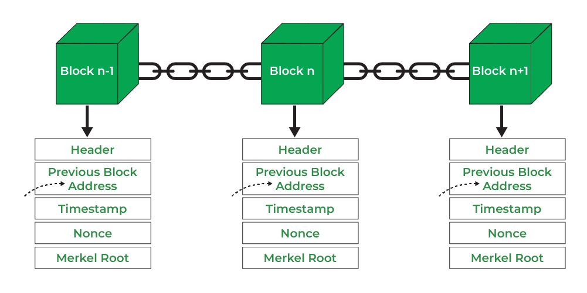
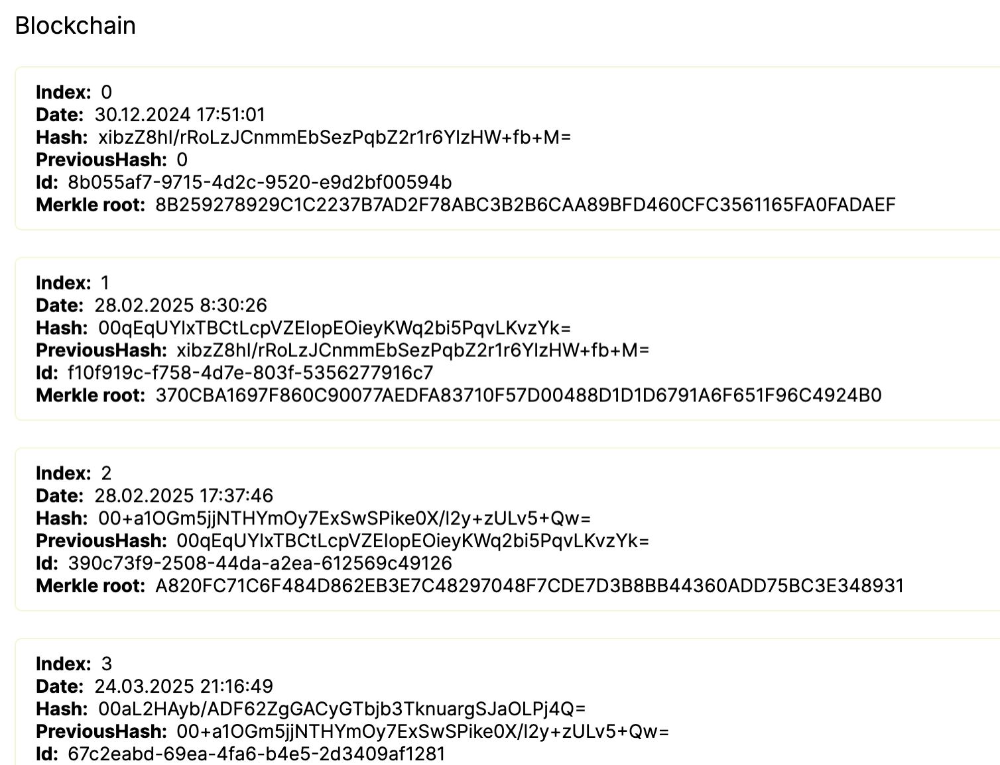

## 2. Theoretical Introduction

### 2.1 Blockchain

It is a sequence of blocks that are interconnected using hashing. Each new block includes the hash of the previous block, which ensures the immutability of the entire chain.

The blockchain serves as a distributed database for all participants of the system, where transactions are accessible and protected.

In Figure 1, you can see how the blocks are connected, and in Figure 2, how they are connected in the blockchain of this project.

  Figure 1: What a blockchain looks like

Figure 2: What the blockchain looks like in this paper

## 2.2 Block

A block is a structured unit of data in a blockchain that contains a list of transactions and metadata necessary to ensure the integrity and security of the chain. When the block is filled, it is hashed using SHA-256 and added to the chain, ensuring data immutability through cryptographic links.

## 2.3 Transaction

A transaction is the transfer of digital coins from one user to another. It contains information about the sender, recipient, and the transfer amount. After being sent, the transaction is verified by the network, recorded in a block, and becomes immutable. All operations are protected by cryptography and occur without intermediaries such as banks.

## 2.4 Node

A node is any device (computer, server) in a decentralized network that participates in processing, storing, and verifying blocks and transactions.

## 2.5 Cryptocurrency

A cryptocurrency is a digital currency based on blockchain technology that uses cryptography to secure transactions. It is decentralized, not controlled by banks or governments, and enables fast and secure transfers without intermediaries.